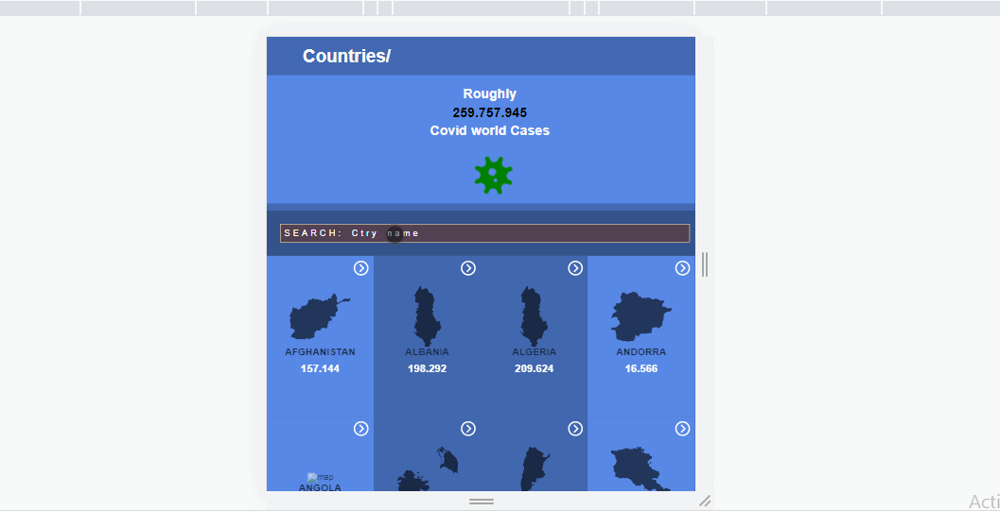
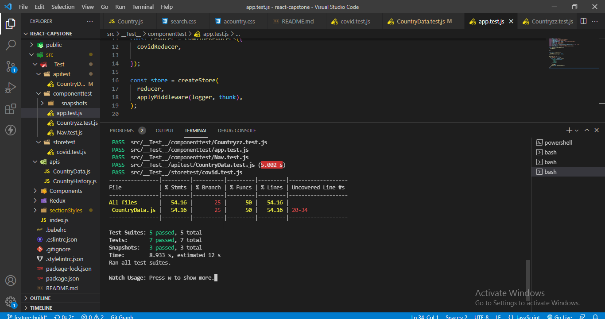

# Project Name
Pandemic proctor

A SPA app that tracks and publish information concerning the global pandemic. The app functions as follows
> App has a home page presenting all the countries and the details page
> You can search for a particular country in the search bar
> The chosen country when clicked takes you to the details page
> Countries and details are gotten and stored in the API
> App styled according to recommended style BEHANCE by Nelson Sakwa

# LIVE PREVIEW
> 

# TEST
> 

# BUILT WITH
- LANGUAGE:
> JavaScript
> Html
> Css
- FRAMEWORK:
>
- LIBRARY: 
> React , Redux

- External API

# PREVIEW
> [LIVE PREVIEW](https://tufoinnkuo10.github.io/Pandemic-Proctor/)

👤 **Author**
- Name: TUFOIN NKUO
- GitHub: [@tufoinnkuo10](https://github.com/tufoinnkuo10)
- Twitter: [@itztenten](https://twitter.com/itztenten)
- LinkedIn: [LinkedIn](https://www.linkedin.com/in/tufoin-nkuo-3b272320b)

Contributions, issues, and feature requests are welcome!

Feel free to check the [issues page](../../issues/).

## Show your support

Give a ⭐️ if you like this project!

## Acknowledgments

- This project is realised thanks to microverse
- The amazing design by Nelson Sakwa 

## 📝 License

This project is [MIT](./LICENSE.md) licensed.
